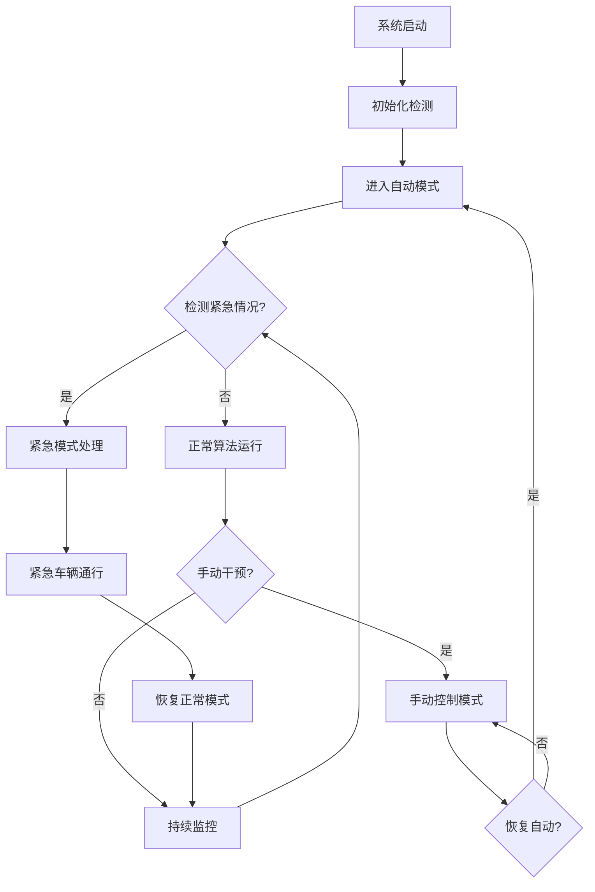

## 1. 产品概述
动态红绿灯配置算法系统是一个智能交通管理系统，通过实时车流量检测和自适应算法优化红绿灯时长配置。该系统能够提高交通效率、减少拥堵，并确保紧急车辆的优先通行。

系统主要解决城市交通拥堵问题，为交通管理部门提供智能化、可视化的红绿灯控制解决方案，实现交通流量的动态优化和紧急情况的快速响应。

## 2. 核心功能

### 2.1 用户角色
| 角色 | 注册方式 | 核心权限 |
|------|----------|----------|
| 系统管理员 | 内部部署配置 | 系统配置、参数调整、用户管理、数据导出 |
| 交通管理员 | 管理员分配账号 | 实时监控、手动控制、紧急事件处理、报表查看 |
| 观察员 | 只读权限分配 | 实时查看、历史数据查看、报表导出 |

### 2.2 功能模块
系统包含以下核心页面：
1. **实时监控页面**：十字路口可视化、红绿灯状态显示、车流量数据展示
2. **算法配置页面**：参数调节、算法模式切换、规则配置
3. **紧急控制页面**：紧急事件处理、手动控制、优先级设置
4. **数据分析页面**：历史数据查看、流量统计、效率分析
5. **系统管理页面**：用户管理、系统配置、日志管理

### 2.3 页面详情
| 页面名称 | 模块名称 | 功能描述 |
|----------|----------|----------|
| 实时监控页面 | 十字路口可视化 | 显示十字路口图形化界面，实时展示红绿灯状态、车道占用情况 |
| 实时监控页面 | 车流量监控 | 实时显示各方向车流量数据、排队长度、平均等待时间 |
| 实时监控页面 | 状态指示器 | 显示系统运行状态、算法模式、网络连接状态 |
| 算法配置页面 | 参数调节面板 | 调整算法参数如绿灯最小时长、最大时长、流量阈值等 |
| 算法配置页面 | 算法模式选择 | 切换固定时长模式、自适应模式、协调控制模式 |
| 算法配置页面 | 规则配置 | 设置各方向权重、时间段配置、特殊规则定义 |
| 紧急控制页面 | 紧急事件处理 | 检测并处理紧急车辆通行请求，提供一键放行功能 |
| 紧急控制页面 | 手动控制面板 | 手动控制红绿灯切换，暂停自动算法运行 |
| 紧急控制页面 | 优先级管理 | 设置不同紧急事件的处理优先级和响应时间 |
| 数据分析页面 | 历史数据查看 | 查看历史流量数据、红绿灯切换记录、事件日志 |
| 数据分析页面 | 统计报表 | 生成流量统计报表、效率分析图表、对比分析 |
| 数据分析页面 | 数据导出 | 导出数据为Excel、CSV格式，支持自定义时间范围 |
| 系统管理页面 | 用户管理 | 添加、删除用户，分配权限，密码重置 |
| 系统管理页面 | 系统配置 | 配置系统参数、网络设置、设备管理 |
| 系统管理页面 | 日志管理 | 查看系统日志、操作日志、错误日志 |

## 3. 核心流程

### 3.1 正常运行流程
系统启动后进入自动监控模式，实时采集车流量数据，算法根据预设参数和实时数据动态调整红绿灯时长。系统持续监控各方向车流情况，确保交通流畅通。

### 3.2 紧急情况处理流程
当检测到紧急车辆时，系统立即评估当前状态，如满足条件则快速切换至紧急模式，为紧急车辆开辟绿色通道，完成后自动恢复正常运行。

### 3.3 手动干预流程
交通管理员可随时接管系统控制，进行手动操作。手动模式结束后，可选择恢复自动运行或保持当前状态。

## 4. 用户界面设计

### 4.1 设计风格
- **主色调**：深灰色(#2D3748)为主背景，绿色(#38A169)表示通行，红色(#E53E3E)表示停止
- **按钮样式**：圆角矩形设计，扁平化风格，悬停效果明显
- **字体选择**：系统字体，主要字号14-16px，标题18-24px
- **布局风格**：卡片式布局，左侧导航栏，主要内容区域采用网格布局
- **图标风格**：使用简洁的线性图标，状态指示使用emoji表情符号

### 4.2 页面设计概览
| 页面名称 | 模块名称 | UI元素 |
|----------|----------|--------|
| 实时监控页面 | 十字路口可视化 | 中央交叉路口图形，四方向车道，红绿灯状态指示灯，车辆图标动画效果 |
| 实时监控页面 | 数据面板 | 卡片式数据显示，包含车流量数字、等待时间条形图、状态指示灯 |
| 算法配置页面 | 参数滑块 | 水平滑块控件，实时数值显示，重置按钮，预设方案选择 |
| 紧急控制页面 | 紧急按钮 | 大型红色紧急按钮，状态指示灯，倒计时显示，确认对话框 |
| 数据分析页面 | 图表区域 | 折线图显示流量趋势，柱状图对比分析，表格显示详细数据 |

### 4.3 响应式设计
- **桌面优先**：主要面向交通管理中心的桌面使用场景
- **平板适配**：支持1280x768及以上分辨率，布局自适应
- **移动查看**：提供移动端查看模式，支持基本监控功能
- **触摸优化**：按钮和控件大小适合触摸操作，最小点击区域44x44像素

## 5. 技术要求

### 5.1 性能要求
- 红绿灯状态切换响应时间 ≤ 100ms
- 车流量数据更新频率 ≥ 1Hz
- 系统支持并发用户数 ≥ 50
- 紧急情况检测延迟 ≤ 500ms

### 5.2 可靠性要求
- 系统可用性 ≥ 99.9%
- 故障恢复时间 ≤ 30秒
- 数据保存时间 ≥ 90天
- 支持离线模式运行 ≥ 2小时

### 5.3 安全要求
- 用户身份验证和权限管理
- 数据传输加密
- 操作日志记录
- 防止未授权访问

## 6. 验收标准

### 6.1 功能验收
- ✅ 红绿灯状态正确显示和切换
- ✅ 车流量数据准确采集和显示
- ✅ 算法参数可正常调节
- ✅ 紧急情况快速响应
- ✅ 历史数据完整保存

### 6.2 性能验收
- ✅ 响应时间满足性能要求
- ✅ 并发用户支持达标
- ✅ 系统稳定性测试通过
- ✅ 故障恢复机制有效

### 6.3 用户体验验收
- ✅ 界面操作直观易用
- ✅ 数据展示清晰明了
- ✅ 错误提示友好准确
- ✅ 帮助文档完整可用