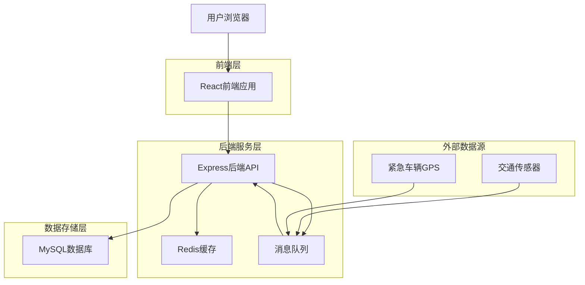
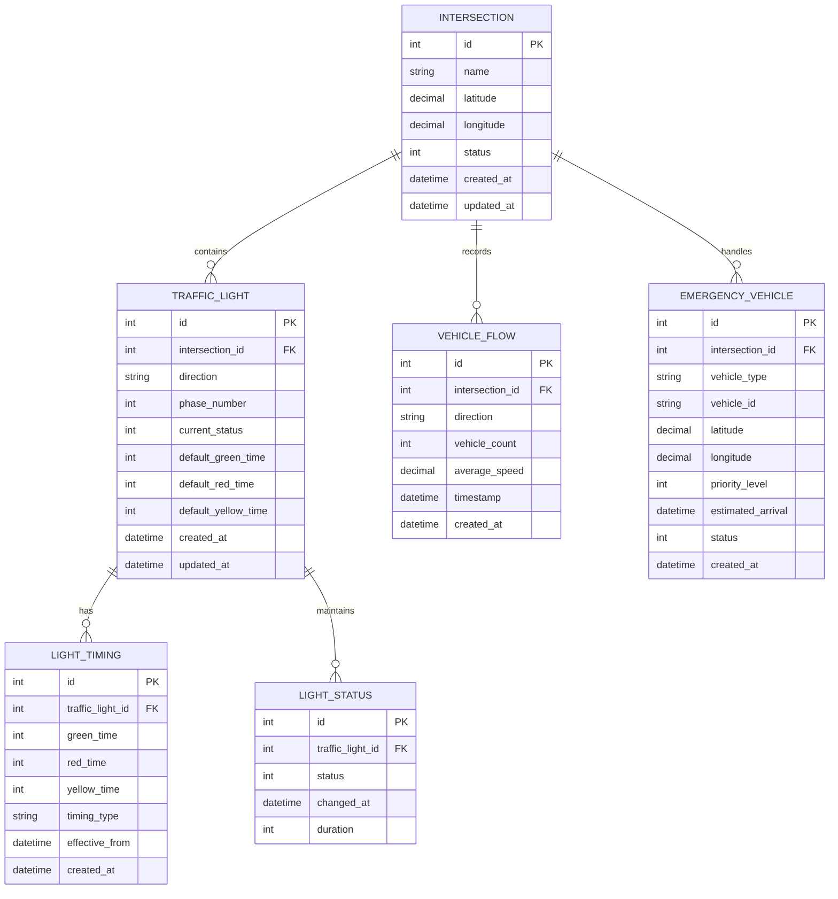
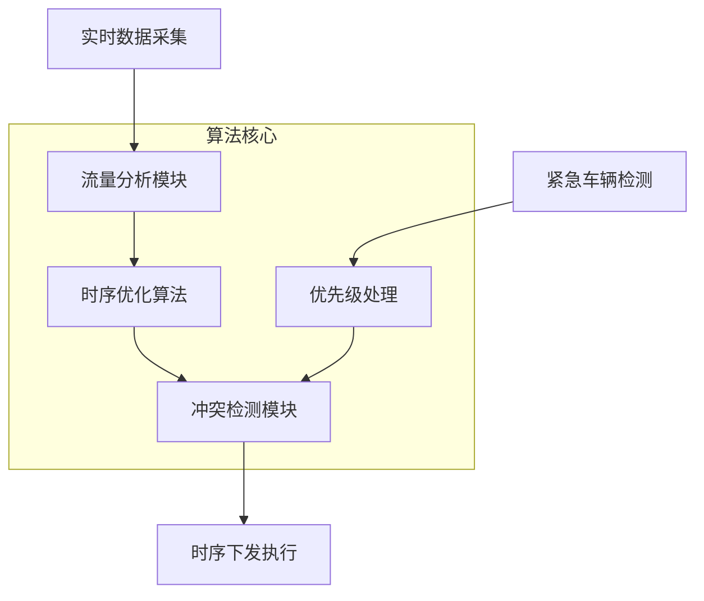
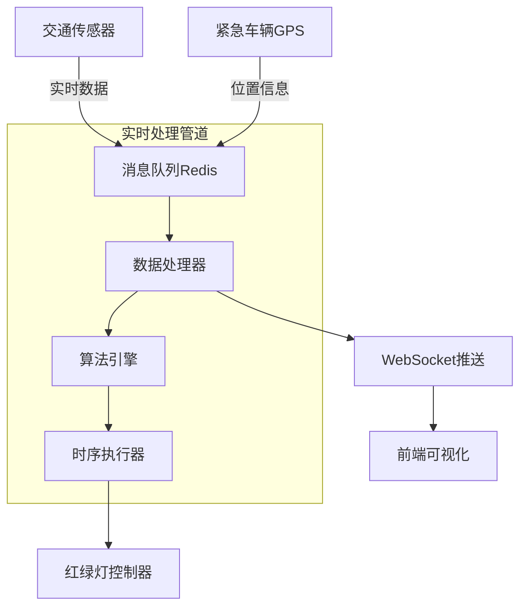

# 动态红绿灯配置算法系统技术架构文档

## 1. 系统架构设计

### 1.1 整体架构


### 1.2 技术栈选型
- **前端**: React@18 + TypeScript + TailwindCSS + WebSocket客户端
- **后端**: Express@4 + TypeScript + Socket.io
- **数据库**: MySQL@8.0 (主数据库) + Redis@7.0 (缓存)
- **消息队列**: Redis Pub/Sub (实时数据流处理)
- **实时通信**: WebSocket (双向通信)

## 2. 数据库设计

### 2.1 数据模型ER图


### 2.2 数据表DDL语句

#### 路口表 (intersections)
```sql
CREATE TABLE intersections (
    id INT PRIMARY KEY AUTO_INCREMENT,
    name VARCHAR(100) NOT NULL,
    latitude DECIMAL(10, 8) NOT NULL,
    longitude DECIMAL(11, 8) NOT NULL,
    status TINYINT DEFAULT 1 COMMENT '1-正常, 0-维护中',
    created_at TIMESTAMP DEFAULT CURRENT_TIMESTAMP,
    updated_at TIMESTAMP DEFAULT CURRENT_TIMESTAMP ON UPDATE CURRENT_TIMESTAMP,
    INDEX idx_status (status),
    INDEX idx_location (latitude, longitude)
) ENGINE=InnoDB DEFAULT CHARSET=utf8mb4;
```

#### 红绿灯表 (traffic_lights)
```sql
CREATE TABLE traffic_lights (
    id INT PRIMARY KEY AUTO_INCREMENT,
    intersection_id INT NOT NULL,
    direction VARCHAR(20) NOT NULL COMMENT 'N/S/E/W',
    phase_number TINYINT NOT NULL COMMENT '相位号',
    current_status TINYINT DEFAULT 0 COMMENT '0-红, 1-黄, 2-绿',
    default_green_time INT DEFAULT 30,
    default_red_time INT DEFAULT 30,
    default_yellow_time INT DEFAULT 3,
    created_at TIMESTAMP DEFAULT CURRENT_TIMESTAMP,
    updated_at TIMESTAMP DEFAULT CURRENT_TIMESTAMP ON UPDATE CURRENT_TIMESTAMP,
    FOREIGN KEY (intersection_id) REFERENCES intersections(id) ON DELETE CASCADE,
    INDEX idx_intersection (intersection_id),
    INDEX idx_status (current_status)
) ENGINE=InnoDB DEFAULT CHARSET=utf8mb4;
```

#### 车辆流量表 (vehicle_flows)
```sql
CREATE TABLE vehicle_flows (
    id INT PRIMARY KEY AUTO_INCREMENT,
    intersection_id INT NOT NULL,
    direction VARCHAR(20) NOT NULL,
    vehicle_count INT NOT NULL,
    average_speed DECIMAL(5,2) DEFAULT 0.00,
    timestamp TIMESTAMP DEFAULT CURRENT_TIMESTAMP,
    created_at TIMESTAMP DEFAULT CURRENT_TIMESTAMP,
    FOREIGN KEY (intersection_id) REFERENCES intersections(id) ON DELETE CASCADE,
    INDEX idx_intersection_time (intersection_id, timestamp),
    INDEX idx_timestamp (timestamp)
) ENGINE=InnoDB DEFAULT CHARSET=utf8mb4;
```

#### 红绿灯时序表 (light_timings)
```sql
CREATE TABLE light_timings (
    id INT PRIMARY KEY AUTO_INCREMENT,
    traffic_light_id INT NOT NULL,
    green_time INT NOT NULL,
    red_time INT NOT NULL,
    yellow_time INT NOT NULL DEFAULT 3,
    timing_type VARCHAR(20) DEFAULT 'dynamic' COMMENT 'static/dynamic/emergency',
    effective_from TIMESTAMP DEFAULT CURRENT_TIMESTAMP,
    created_at TIMESTAMP DEFAULT CURRENT_TIMESTAMP,
    FOREIGN KEY (traffic_light_id) REFERENCES traffic_lights(id) ON DELETE CASCADE,
    INDEX idx_traffic_light (traffic_light_id),
    INDEX idx_effective_time (effective_from)
) ENGINE=InnoDB DEFAULT CHARSET=utf8mb4;
```

#### 紧急车辆表 (emergency_vehicles)
```sql
CREATE TABLE emergency_vehicles (
    id INT PRIMARY KEY AUTO_INCREMENT,
    intersection_id INT NOT NULL,
    vehicle_type VARCHAR(50) NOT NULL COMMENT '救护车/消防车/警车',
    vehicle_id VARCHAR(50) NOT NULL,
    latitude DECIMAL(10, 8) NOT NULL,
    longitude DECIMAL(11, 8) NOT NULL,
    priority_level TINYINT DEFAULT 1 COMMENT '1-5, 5最高',
    estimated_arrival TIMESTAMP,
    status TINYINT DEFAULT 0 COMMENT '0-等待, 1-已通过',
    created_at TIMESTAMP DEFAULT CURRENT_TIMESTAMP,
    FOREIGN KEY (intersection_id) REFERENCES intersections(id) ON DELETE CASCADE,
    INDEX idx_intersection (intersection_id),
    INDEX idx_status (status),
    INDEX idx_arrival_time (estimated_arrival)
) ENGINE=InnoDB DEFAULT CHARSET=utf8mb4;
```

## 3. 动态红绿灯算法核心逻辑

### 3.1 算法架构


### 3.2 核心算法实现

#### 流量自适应算法
```typescript
interface TrafficFlowData {
    intersectionId: number;
    direction: string;
    vehicleCount: number;
    averageSpeed: number;
    timestamp: Date;
}

interface LightTiming {
    greenTime: number;
    redTime: number;
    yellowTime: number;
}

class AdaptiveTrafficAlgorithm {
    private readonly MIN_GREEN_TIME = 15; // 最小绿灯时间
    private readonly MAX_GREEN_TIME = 120; // 最大绿灯时间
    private readonly FLOW_WEIGHT = 0.7; // 流量权重
    private readonly SPEED_WEIGHT = 0.3; // 速度权重

    calculateOptimalTiming(flowData: TrafficFlowData[]): LightTiming {
        // 1. 计算各方向权重
        const weights = this.calculateDirectionWeights(flowData);
        
        // 2. 基于权重分配绿灯时间
        const totalGreenTime = this.calculateTotalGreenTime(flowData);
        const greenTimes = this.allocateGreenTime(weights, totalGreenTime);
        
        // 3. 计算红灯时间（基于对向绿灯时间）
        const redTimes = this.calculateRedTime(greenTimes);
        
        return {
            greenTime: Math.max(this.MIN_GREEN_TIME, Math.min(this.MAX_GREEN_TIME, greenTimes.North)),
            redTime: redTimes.North,
            yellowTime: 3 // 固定黄灯时间
        };
    }

    private calculateDirectionWeights(flowData: TrafficFlowData[]): Record<string, number> {
        const weights: Record<string, number> = {};
        let totalWeightedScore = 0;

        flowData.forEach(data => {
            const flowScore = data.vehicleCount * this.FLOW_WEIGHT;
            const speedScore = (data.averageSpeed / 60) * this.SPEED_WEIGHT;
            weights[data.direction] = flowScore + speedScore;
            totalWeightedScore += weights[data.direction];
        });

        // 归一化权重
        Object.keys(weights).forEach(direction => {
            weights[direction] = weights[direction] / totalWeightedScore;
        });

        return weights;
    }

    private calculateTotalGreenTime(flowData: TrafficFlowData[]): number {
        const totalFlow = flowData.reduce((sum, data) => sum + data.vehicleCount, 0);
        
        if (totalFlow < 10) return 60; // 低流量
        if (totalFlow < 30) return 90; // 中等流量
        if (totalFlow < 60) return 120; // 高流量
        return 150; // 极高流量
    }

    private allocateGreenTime(weights: Record<string, number>, totalTime: number): Record<string, number> {
        const greenTimes: Record<string, number> = {};
        
        Object.keys(weights).forEach(direction => {
            greenTimes[direction] = Math.round(totalTime * weights[direction]);
        });

        return greenTimes;
    }

    private calculateRedTime(greenTimes: Record<string, number>): Record<string, number> {
        const redTimes: Record<string, number> = {};
        const directions = ['North', 'South', 'East', 'West'];
        
        directions.forEach(direction => {
            const oppositeDirection = this.getOppositeDirection(direction);
            redTimes[direction] = greenTimes[oppositeDirection] + 3; // 加黄灯时间
        });

        return redTimes;
    }

    private getOppositeDirection(direction: string): string {
        const opposites: Record<string, string> = {
            'North': 'South',
            'South': 'North',
            'East': 'West',
            'West': 'East'
        };
        return opposites[direction];
    }
}
```

## 4. 紧急情况处理机制

### 4.1 紧急车辆优先级处理
```typescript
interface EmergencyVehicle {
    id: number;
    vehicleType: 'ambulance' | 'fire_truck' | 'police';
    priorityLevel: number; // 1-5, 5最高
    estimatedArrival: Date;
    intersectionId: number;
    direction: string;
}

class EmergencyHandler {
    private readonly EMERGENCY_GREEN_TIME = 60; // 紧急绿灯时间
    private readonly PREEMPT_DELAY = 5; // 预清空时间

    async handleEmergencyVehicle(emergency: EmergencyVehicle): Promise<void> {
        const intersectionId = emergency.intersectionId;
        const arrivalTime = new Date(emergency.estimatedArrival);
        const now = new Date();
        const timeToArrival = (arrivalTime.getTime() - now.getTime()) / 1000;

        if (timeToArrival <= this.PREEMPT_DELAY) {
            // 立即切换到紧急车辆方向绿灯
            await this.preemptTrafficLights(intersectionId, emergency.direction);
        } else {
            // 设置定时器，在适当时间切换
            this.scheduleEmergencyPreemption(intersectionId, emergency.direction, timeToArrival);
        }
    }

    private async preemptTrafficLights(intersectionId: number, direction: string): Promise<void> {
        // 1. 获取当前路口所有红绿灯状态
        const currentLights = await this.getTrafficLights(intersectionId);
        
        // 2. 检查是否可以安全切换
        if (await this.canSafelySwitch(currentLights, direction)) {
            // 3. 执行紧急切换
            await this.executeEmergencySwitch(intersectionId, direction);
            
            // 4. 记录紧急事件
            await this.logEmergencyEvent(intersectionId, direction);
        }
    }

    private async canSafelySwitch(currentLights: any[], targetDirection: string): Promise<boolean> {
        // 安全检查：确保没有冲突方向有车辆通过
        const conflictingDirections = this.getConflictingDirections(targetDirection);
        
        for (const light of currentLights) {
            if (conflictingDirections.includes(light.direction) && light.current_status === 2) {
                // 冲突方向是绿灯，检查是否有车辆
                const hasVehicle = await this.checkVehiclePresence(light.intersection_id, light.direction);
                if (hasVehicle) {
                    return false; // 有车辆，不能立即切换
                }
            }
        }
        
        return true;
    }

    private getConflictingDirections(direction: string): string[] {
        const conflicts: Record<string, string[]> = {
            'North': ['East', 'West'],
            'South': ['East', 'West'],
            'East': ['North', 'South'],
            'West': ['North', 'South']
        };
        return conflicts[direction] || [];
    }

    private async executeEmergencySwitch(intersectionId: number, direction: string): Promise<void> {
        // 1. 将所有冲突方向设置为红灯
        const conflictingDirections = this.getConflictingDirections(direction);
        await this.setLightsRed(intersectionId, conflictingDirections);
        
        // 2. 等待黄灯时间
        await this.sleep(3000);
        
        // 3. 将目标方向设置为绿灯
        await this.setLightGreen(intersectionId, direction, this.EMERGENCY_GREEN_TIME);
        
        // 4. 发送WebSocket通知
        await this.notifyEmergencySwitch(intersectionId, direction);
    }
}
```

## 5. 实时数据流处理架构

### 5.1 数据流架构图


### 5.2 数据处理器实现
```typescript
interface SensorData {
    sensorId: string;
    intersectionId: number;
    direction: string;
    vehicleCount: number;
    averageSpeed: number;
    timestamp: Date;
}

class RealtimeDataProcessor {
    private redisClient: Redis;
    private algorithmEngine: AdaptiveTrafficAlgorithm;
    private websocketServer: WebSocket.Server;

    constructor(redisClient: Redis, websocketServer: WebSocket.Server) {
        this.redisClient = redisClient;
        this.algorithmEngine = new AdaptiveTrafficAlgorithm();
        this.websocketServer = websocketServer;
    }

    async startProcessing(): Promise<void> {
        // 订阅传感器数据频道
        await this.redisClient.subscribe('sensor:data');
        await this.redisClient.subscribe('emergency:vehicle');
        
        this.redisClient.on('message', async (channel, message) => {
            try {
                const data = JSON.parse(message);
                
                if (channel === 'sensor:data') {
                    await this.processSensorData(data);
                } else if (channel === 'emergency:vehicle') {
                    await this.processEmergencyData(data);
                }
            } catch (error) {
                console.error('处理消息失败:', error);
            }
        });
    }

    private async processSensorData(data: SensorData): Promise<void> {
        // 1. 存储数据到数据库
        await this.storeVehicleFlow(data);
        
        // 2. 更新Redis缓存
        await this.updateTrafficCache(data);
        
        // 3. 检查是否需要调整时序
        const shouldAdjust = await this.shouldAdjustTiming(data.intersectionId);
        
        if (shouldAdjust) {
            // 4. 获取最近流量数据
            const recentFlowData = await this.getRecentFlowData(data.intersectionId);
            
            // 5. 运行算法计算新时序
            const newTiming = this.algorithmEngine.calculateOptimalTiming(recentFlowData);
            
            // 6. 应用新时序
            await this.applyNewTiming(data.intersectionId, newTiming);
            
            // 7. 推送更新到前端
            await this.pushUpdateToFrontend(data.intersectionId, newTiming);
        }
    }

    private async updateTrafficCache(data: SensorData): Promise<void> {
        const cacheKey = `traffic:${data.intersectionId}:${data.direction}`;
        const cacheData = {
            vehicleCount: data.vehicleCount,
            averageSpeed: data.averageSpeed,
            timestamp: data.timestamp
        };
        
        // 存储到Redis，设置5分钟过期时间
        await this.redisClient.setex(cacheKey, 300, JSON.stringify(cacheData));
    }

    private async shouldAdjustTiming(intersectionId: number): Promise<boolean> {
        const cacheKey = `last_adjustment:${intersectionId}`;
        const lastAdjustment = await this.redisClient.get(cacheKey);
        
        if (!lastAdjustment) {
            return true; // 从未调整过
        }
        
        const lastTime = new Date(lastAdjustment);
        const now = new Date();
        const minutesSinceLastAdjustment = (now.getTime() - lastTime.getTime()) / 60000;
        
        // 至少间隔2分钟才能再次调整
        return minutesSinceLastAdjustment >= 2;
    }

    private async pushUpdateToFrontend(intersectionId: number, timing: any): Promise<void> {
        const message = {
            type: 'timing_update',
            intersectionId: intersectionId,
            data: timing,
            timestamp: new Date()
        };
        
        // 向所有连接的客户端推送更新
        this.websocketServer.clients.forEach(client => {
            if (client.readyState === WebSocket.OPEN) {
                client.send(JSON.stringify(message));
            }
        });
    }
}
```

## 6. API接口设计

### 6.1 RESTful API接口

#### 路口管理接口
```typescript
// 获取所有路口
GET /api/intersections
Response: {
    success: boolean;
    data: Intersection[];
}

// 获取路口详情
GET /api/intersections/:id
Response: {
    success: boolean;
    data: {
        intersection: Intersection;
        trafficLights: TrafficLight[];
        currentFlow: VehicleFlow[];
    }
}

// 更新路口信息
PUT /api/intersections/:id
Request: {
    name?: string;
    status?: number;
}
Response: {
    success: boolean;
    data: Intersection;
}
```

#### 红绿灯控制接口
```typescript
// 获取红绿灯状态
GET /api/traffic-lights/intersection/:intersectionId
Response: {
    success: boolean;
    data: TrafficLightStatus[];
}

// 手动控制红绿灯
POST /api/traffic-lights/control
Request: {
    intersectionId: number;
    lightId: number;
    action: 'switch_green' | 'switch_red' | 'switch_yellow';
    duration?: number;
}
Response: {
    success: boolean;
    message: string;
}

// 获取时序历史
GET /api/traffic-lights/timing-history
Query: {
    intersectionId: number;
    startDate: string;
    endDate: string;
}
Response: {
    success: boolean;
    data: TimingHistory[];
}
```

#### 流量数据接口
```typescript
// 获取实时流量
GET /api/vehicle-flows/realtime/:intersectionId
Response: {
    success: boolean;
    data: {
        flows: VehicleFlow[];
        summary: {
            totalVehicles: number;
            averageSpeed: number;
            peakDirection: string;
        }
    }
}

// 获取历史流量统计
GET /api/vehicle-flows/statistics
Query: {
    intersectionId: number;
    period: 'hour' | 'day' | 'week';
}
Response: {
    success: boolean;
    data: FlowStatistics[];
}
```

#### 紧急车辆接口
```typescript
// 报告紧急车辆
POST /api/emergency-vehicles/report
Request: {
    vehicleType: 'ambulance' | 'fire_truck' | 'police';
    intersectionId: number;
    direction: string;
    priorityLevel: number;
    estimatedArrival: string;
}
Response: {
    success: boolean;
    data: EmergencyVehicle;
}

// 获取紧急事件列表
GET /api/emergency-vehicles/events
Query: {
    status?: 'pending' | 'processed';
    intersectionId?: number;
}
Response: {
    success: boolean;
    data: EmergencyEvent[];
}
```

## 7. 可视化界面设计

### 7.1 前端路由设计
```typescript
const routes = [
    { path: '/', component: Dashboard, name: '总览' },
    { path: '/intersections', component: IntersectionList, name: '路口管理' },
    { path: '/intersections/:id', component: IntersectionDetail, name: '路口详情' },
    { path: '/traffic-control', component: TrafficControl, name: '交通控制' },
    { path: '/flow-analytics', component: FlowAnalytics, name: '流量分析' },
    { path: '/emergency', component: EmergencyManagement, name: '紧急管理' },
    { path: '/settings', component: Settings, name: '系统设置' }
];
```

### 7.2 核心组件设计

#### 实时交通监控面板
```typescript
interface TrafficMonitorProps {
    intersectionId: number;
    realtimeData: TrafficData;
    onEmergencyReport: (data: EmergencyReport) => void;
}

const TrafficMonitor: React.FC<TrafficMonitorProps> = ({
    intersectionId,
    realtimeData,
    onEmergencyReport
}) => {
    return (
        <div className="traffic-monitor">
            <div className="traffic-lights-grid">
                {realtimeData.lights.map(light => (
                    <TrafficLightIndicator
                        key={light.id}
                        direction={light.direction}
                        status={light.currentStatus}
                        remainingTime={light.remainingTime}
                    />
                ))}
            </div>
            
            <div className="flow-statistics">
                <VehicleFlowChart data={realtimeData.flows} />
                <FlowStatisticsSummary data={realtimeData.summary} />
            </div>
            
            <EmergencyControlPanel
                intersectionId={intersectionId}
                onEmergencyReport={onEmergencyReport}
            />
        </div>
    );
};
```

#### 动态时序图表组件
```typescript
interface TimingChartProps {
    timingHistory: TimingData[];
    currentTiming: CurrentTiming;
}

const TimingChart: React.FC<TimingChartProps> = ({
    timingHistory,
    currentTiming
}) => {
    const chartData = useMemo(() => {
        return timingHistory.map(item => ({
            time: item.timestamp,
            greenTime: item.greenTime,
            redTime: item.redTime,
            yellowTime: item.yellowTime,
            vehicleCount: item.vehicleCount
        }));
    }, [timingHistory]);

    return (
        <div className="timing-chart">
            <LineChart data={chartData}>
                <Line type="monotone" dataKey="greenTime" stroke="#00ff00" />
                <Line type="monotone" dataKey="redTime" stroke="#ff0000" />
                <Line type="monotone" dataKey="yellowTime" stroke="#ffff00" />
                <Line type="monotone" dataKey="vehicleCount" stroke="#0000ff" />
            </LineChart>
            
            <CurrentTimingDisplay timing={currentTiming} />
        </div>
    );
};
```

## 8. 扩展性设计

### 8.1 水平扩展架构
- **微服务拆分**: 将算法引擎、数据处理、WebSocket服务拆分为独立服务
- **数据库分片**: 按路口ID进行数据分片，支持大规模路口管理
- **缓存集群**: Redis Cluster模式，支持高并发读写
- **负载均衡**: Nginx负载均衡，支持多实例部署

### 8.2 算法插件化设计
```typescript
interface ITrafficAlgorithm {
    calculateTiming(flowData: TrafficFlowData[]): LightTiming;
    getAlgorithmName(): string;
    getParameters(): AlgorithmParameter[];
}

class AlgorithmManager {
    private algorithms: Map<string, ITrafficAlgorithm> = new Map();
    
    registerAlgorithm(algorithm: ITrafficAlgorithm): void {
        this.algorithms.set(algorithm.getAlgorithmName(), algorithm);
    }
    
    getAlgorithm(name: string): ITrafficAlgorithm | undefined {
        return this.algorithms.get(name);
    }
    
    listAlgorithms(): string[] {
        return Array.from(this.algorithms.keys());
    }
}
```

### 8.3 监控与告警
- **性能监控**: 接口响应时间、算法执行时间、数据库查询性能
- **业务监控**: 红绿灯切换频率、紧急事件处理成功率
- **系统监控**: CPU使用率、内存使用率、网络延迟
- **告警机制**: 基于阈值的多级告警，支持短信、邮件、Webhook通知

这个技术架构文档为动态红绿灯配置算法系统提供了完整的技术指导，涵盖了系统架构、数据库设计、核心算法、紧急处理机制、可视化界面和扩展性设计等各个方面。