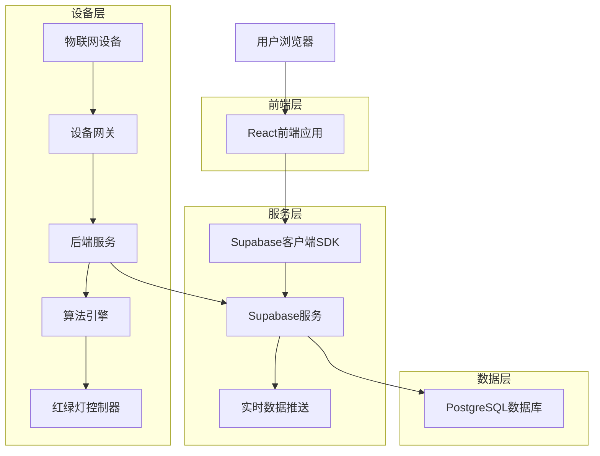
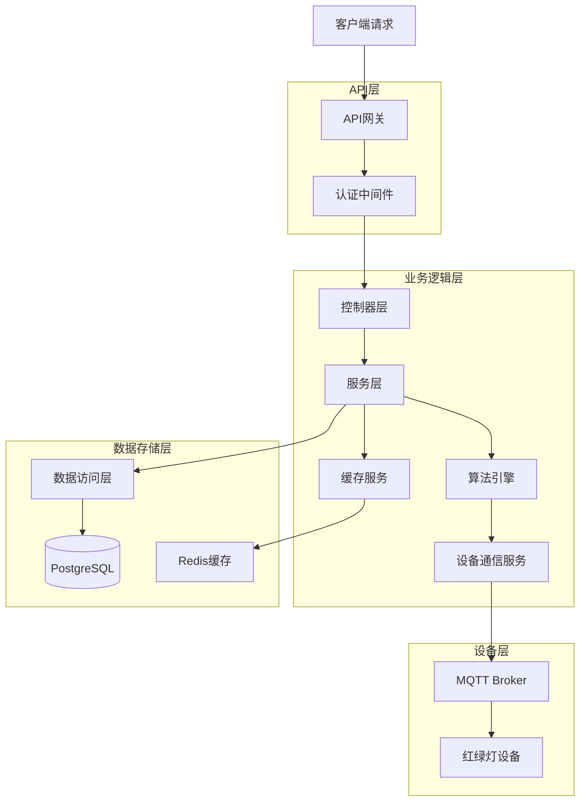
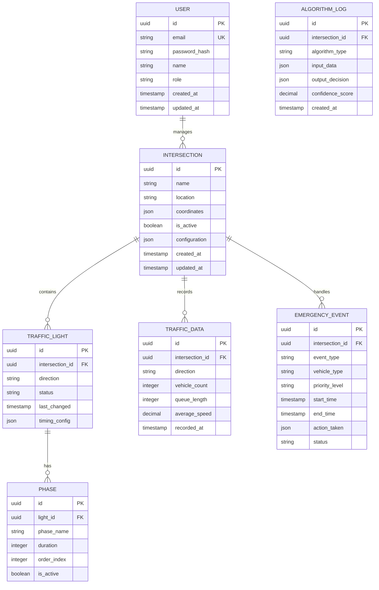

## 1. 架构设计



## 2. 技术描述

### 2.1 前端技术栈

* **框架**: React\@18 + TypeScript

* **状态管理**: React Context + useReducer

* **UI组件**: Ant Design\@5 + Tailwind CSS

* **图表库**: ECharts\@5

* **实时通信**: Supabase Realtime

* **构建工具**: Vite

### 2.2 后端技术栈

* **核心服务**: Supabase (PostgreSQL + Realtime + Auth)

* **算法引擎**: Python\@3.9 + FastAPI

* **设备通信**: MQTT协议 + WebSocket

* **缓存**: Redis\@7 (用于高频数据缓存)

* **消息队列**: Redis Pub/Sub

### 2.3 第三方服务

* **地图服务**: 高德地图API (用于路口定位)

* **推送服务**: 极光推送 (用于紧急通知)

* **日志服务**: Sentry (用于错误监控)

## 3. 路由定义

| 路由         | 用途     | 权限要求  |
| ---------- | ------ | ----- |
| /          | 登录页面   | 匿名访问  |
| /dashboard | 实时监控面板 | 已认证用户 |
| /algorithm | 算法配置页面 | 管理员权限 |
| /emergency | 紧急控制页面 | 交通管理员 |
| /analytics | 数据分析页面 | 已认证用户 |
| /settings  | 系统设置页面 | 管理员权限 |
| /profile   | 用户资料页面 | 已认证用户 |

## 4. API定义

### 4.1 认证相关API

#### 用户登录

```
POST /api/auth/login
```

请求参数:

| 参数名      | 参数类型   | 是否必需 | 描述     |
| -------- | ------ | ---- | ------ |
| email    | string | 是    | 用户邮箱地址 |
| password | string | 是    | 用户密码   |

响应参数:

| 参数名            | 参数类型   | 描述      |
| -------------- | ------ | ------- |
| access\_token  | string | JWT访问令牌 |
| refresh\_token | string | 刷新令牌    |
| user           | object | 用户信息对象  |

### 4.2 交通数据API

#### 获取实时交通数据

```
GET /api/traffic/realtime
```

查询参数:

| 参数名              | 参数类型   | 是否必需 | 描述            |
| ---------------- | ------ | ---- | ------------- |
| intersection\_id | string | 否    | 路口ID，不指定则返回全部 |

响应数据:

```json
{
  "intersections": [
    {
      "id": "int_001",
      "name": "中山路与解放路交叉口",
      "status": "normal",
      "current_phase": "north_south_green",
      "phases": [
        {
          "direction": "north_south",
          "status": "green",
          "remaining_time": 45,
          "traffic_flow": 12,
          "queue_length": 5
        }
      ],
      "timestamp": "2024-01-15T10:30:00Z"
    }
  ]
}
```

#### 更新红绿灯状态

```
POST /api/traffic/light/control
```

请求参数:

| 参数名              | 参数类型   | 是否必需 | 描述                                                          |
| ---------------- | ------ | ---- | ----------------------------------------------------------- |
| intersection\_id | string | 是    | 路口ID                                                        |
| action           | string | 是    | 操作类型: "switch\_phase", "emergency\_mode", "manual\_control" |
| target\_phase    | string | 否    | 目标相位 (当action为switch\_phase时必需)                             |
| duration         | number | 否    | 持续时间(秒)                                                     |

### 4.3 算法配置API

#### 获取算法参数

```
GET /api/algorithm/config
```

#### 更新算法参数

```
POST /api/algorithm/config
```

请求参数:

| 参数名                | 参数类型   | 是否必需 | 描述        |
| ------------------ | ------ | ---- | --------- |
| min\_green\_time   | number | 否    | 最小绿灯时间(秒) |
| max\_green\_time   | number | 否    | 最大绿灯时间(秒) |
| yellow\_time       | number | 否    | 黄灯时间(秒)   |
| traffic\_threshold | number | 否    | 流量阈值      |
| adaptation\_factor | number | 否    | 自适应因子     |

## 5. 服务器架构图



## 6. 数据模型

### 6.1 实体关系图



### 6.2 数据定义语言

#### 用户表 (users)

```sql
-- 创建用户表
CREATE TABLE users (
    id UUID PRIMARY KEY DEFAULT gen_random_uuid(),
    email VARCHAR(255) UNIQUE NOT NULL,
    password_hash VARCHAR(255) NOT NULL,
    name VARCHAR(100) NOT NULL,
    role VARCHAR(20) NOT NULL DEFAULT 'observer' CHECK (role IN ('admin', 'operator', 'observer')),
    is_active BOOLEAN DEFAULT true,
    last_login_at TIMESTAMP WITH TIME ZONE,
    created_at TIMESTAMP WITH TIME ZONE DEFAULT NOW(),
    updated_at TIMESTAMP WITH TIME ZONE DEFAULT NOW()
);

-- 创建索引
CREATE INDEX idx_users_email ON users(email);
CREATE INDEX idx_users_role ON users(role);

-- 设置权限
GRANT SELECT ON users TO anon;
GRANT ALL PRIVILEGES ON users TO authenticated;
```

#### 路口表 (intersections)

```sql
-- 创建路口表
CREATE TABLE intersections (
    id UUID PRIMARY KEY DEFAULT gen_random_uuid(),
    name VARCHAR(255) NOT NULL,
    location VARCHAR(500),
    coordinates JSONB,
    is_active BOOLEAN DEFAULT true,
    configuration JSONB DEFAULT '{}',
    created_at TIMESTAMP WITH TIME ZONE DEFAULT NOW(),
    updated_at TIMESTAMP WITH TIME ZONE DEFAULT NOW()
);

-- 创建索引
CREATE INDEX idx_intersections_active ON intersections(is_active);
CREATE INDEX idx_intersections_created_at ON intersections(created_at DESC);

-- 设置权限
GRANT SELECT ON intersections TO anon;
GRANT ALL PRIVILEGES ON intersections TO authenticated;
```

#### 交通数据表 (traffic\_data)

```sql
-- 创建交通数据表
CREATE TABLE traffic_data (
    id UUID PRIMARY KEY DEFAULT gen_random_uuid(),
    intersection_id UUID REFERENCES intersections(id) ON DELETE CASCADE,
    direction VARCHAR(10) NOT NULL CHECK (direction IN ('north', 'south', 'east', 'west')),
    vehicle_count INTEGER NOT NULL DEFAULT 0,
    queue_length INTEGER DEFAULT 0,
    average_speed DECIMAL(5,2) DEFAULT 0.00,
    recorded_at TIMESTAMP WITH TIME ZONE DEFAULT NOW()
);

-- 创建索引
CREATE INDEX idx_traffic_data_intersection ON traffic_data(intersection_id);
CREATE INDEX idx_traffic_data_recorded_at ON traffic_data(recorded_at DESC);
CREATE INDEX idx_traffic_data_direction ON traffic_data(direction);

-- 设置权限
GRANT SELECT ON traffic_data TO anon;
GRANT ALL PRIVILEGES ON traffic_data TO authenticated;
```

#### 红绿灯状态表 (traffic\_lights)

```sql
-- 创建红绿灯状态表
CREATE TABLE traffic_lights (
    id UUID PRIMARY KEY DEFAULT gen_random_uuid(),
    intersection_id UUID REFERENCES intersections(id) ON DELETE CASCADE,
    direction VARCHAR(10) NOT NULL CHECK (direction IN ('north', 'south', 'east', 'west')),
    status VARCHAR(20) NOT NULL DEFAULT 'red' CHECK (status IN ('red', 'yellow', 'green')),
    last_changed TIMESTAMP WITH TIME ZONE DEFAULT NOW(),
    timing_config JSONB DEFAULT '{}',
    created_at TIMESTAMP WITH TIME ZONE DEFAULT NOW()
);

-- 创建索引
CREATE INDEX idx_traffic_lights_intersection ON traffic_lights(intersection_id);
CREATE INDEX idx_traffic_lights_status ON traffic_lights(status);
CREATE INDEX idx_traffic_lights_last_changed ON traffic_lights(last_changed DESC);

-- 设置权限
GRANT SELECT ON traffic_lights TO anon;
GRANT ALL PRIVILEGES ON traffic_lights TO authenticated;
```

#### 紧急事件表 (emergency
